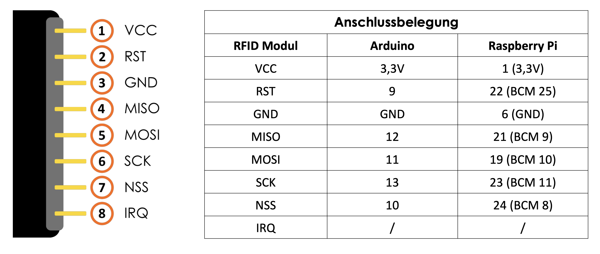

# Ikarus SPS MFRC522 package
This package ships with a wrapper to access the MFRC522 module of JOY-IT.

### Installation
You need to install the [php-spi-extension](https://github.com/tasoftch/php-spi-extension) and the [php-secure-int64-extension](https://github.com/tasoftch/php-secure-int64-extension) (only when using badges with more than 4 byte UIDs).

### Wiring



### Usage

Read from a badge or chip:

```php
<?php
use Ikarus\MiFare\Authentication\BasicAuthentication;
use Ikarus\MiFare\Joyit\MFRC522_SPI;
use Ikarus\MiFare\Sector\MutableCardSector;
use Ikarus\Raspberry\Pinout\Revision_3\DynamicBCMPinout;
use Ikarus\Raspberry\RaspberryPiDevice;
use TASoft\Bus\SPI;

$dev = RaspberryPiDevice::getDevice();
$dev->requirePinout(
	(new DynamicBCMPinout())
		->addOutputPin(25)
);

$reset = $dev->getOutputPin(25);

$sensor = new MFRC522_SPI(new SPI(0, 0, 1000000), $reset);
echo "Please hold a card or badge near the sensor.", PHP_EOL;

$id = $sensor->readCardID(3); // Wait for 3 seconds before cancel.
echo "TAG: $id", PHP_EOL;

if($id) {
	$sector = new MutableCardSector(
	    MutableCardSector::SECTOR_ID_02,
	    BasicAuthentication::defaultAuthentication() // Key A: 0xFFFFFFFFFFFF
	);
	$sensor->readCardSector($id, $sector);

	print_r($sector);
} else
	echo "No tag detected.", PHP_EOL;

```

Write to a badge or chip:
```php
<?php
use Ikarus\MiFare\Authentication\BasicAuthentication;
use Ikarus\MiFare\Joyit\MFRC522_SPI;
use Ikarus\MiFare\Sector\CardSector;
use Ikarus\MiFare\Sector\MutableCardSector;
use Ikarus\Raspberry\Pinout\Revision_3\DynamicBCMPinout;
use Ikarus\Raspberry\RaspberryPiDevice;
use TASoft\Bus\SPI;

$dev = RaspberryPiDevice::getDevice();
$dev->requirePinout(
	(new DynamicBCMPinout())
		->addOutputPin(25)
);

$reset = $dev->getOutputPin(25);

// Read from command line
$string = readline("Please enter a text: ");
$string = substr(trim($string), 0, 48); // Truncate to maximum block size
echo "TEXT ($string)", PHP_EOL;

$sensor = new MFRC522_SPI(new SPI(0, 0, 1000000), $reset);
echo "Please hold a card or badge near the sensor.", PHP_EOL;
$id = $sensor->readCardID(3);
echo "TAG: $id\n";

if($id) {
	$sector = new CardSector(
	    CardSector::SECTOR_ID_02,
	    $string,
	    BasicAuthentication::defaultAuthentication()
	);
	$sensor->writeCardSector($id, $sector);

	echo "OK, WRITTEN. VERIFY NOW ...\n";
	usleep(100000);
	
	$sector = new MutableCardSector(
	    MutableCardSector::SECTOR_ID_02,
	    BasicAuthentication::defaultAuthentication() // Key A: 0xFFFFFFFFFFFF
	);
	
	$id = $sensor->readCardID(3);
	$sensor->readCardSector($id, $sector);

	print_r($sector);
} else
	echo "No tag detected.", PHP_EOL;

```